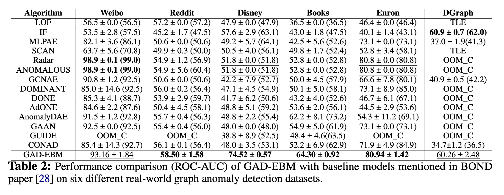

<h1 align="center">GAD-EBM: Graph Anomaly Detection<br> using Energy-Based Models</h1>

This repository contains the PyTorch implementation of the NeurIPS 2023 New Frontiers in Graph Learning (GLFrontiers) workshop paper "GAD-EBM: Graph Anomaly Detection using Energy-Based Models" by Amit Roy, Juan Shu, Olivier Elshocht, Jeroen Smeets, Ruqi Zhang and Pan Li.

## Abstract
<p align="justify">
Graph Anomaly Detection (GAD) is essential in fields ranging from network security, and bioinformatics to finance. Previous works often adopt auto-encoders to compute reconstruction errors for anomaly detection: anomalies are hard to be reconstructed. In this work, we revisit the first principle for anomaly detection, i.e., the Neyman-Pearson rule, where the optimal anomaly detector is based on the likelihood of a data point given the normal distribution of data. However, in practice, the distribution is often unknown and the estimation of the distribution of graph-structured data may be hard. Moreover, the likelihood computation of a graph-structured data point may be challenging as well. In this paper, we propose a novel approach GAD-EBM that can estimate the distribution of graphs and compute likelihoods efficiently by using Energy-Based Models (EBMs) over graphs. GAD-EBM approaches the likelihood of a rooted subgraph of node $v$, and further can leverage the likelihood to accurately identify whether node $v$ is anomalous or not. Traditional score matching for training EBMs may not be used to apply EBMs that model the distribution of graphs because of complicated discreteness and multi-modality of graph data. We propose a Subgraph Score Matching (SSM) approach, which is specifically designed for graph data based on a novel framework of neighborhood state-space graphs. Experimentation conducted on six real-world datasets validates the effectiveness and efficiency of GAD-EBM and the source code for GAD-EBM is openly available. 
</p>

    


## Neighborhood State-Space Graph

 <br>
<p align="justify"> 
<b>Exapmle of a neighborhood state-space graph</b>
</p>


## Main Parameters

```
--dataset                    Anomaly detection dataset (default: disney)
--perturb_percent            Percentages of edges to be added/deleted (default: 0.05)
--seed                       Random Number Seed (default: 42)
--nb_epochs                  Number of epochs (default: 200)
--hidden_dim                 Hidden Dimension Size (default: 16)
--lr                         Learning Rate (default: 0.01)
--l2_coef                    Regularization coefficient (default: 0.01)
--drop_edge                  Drop Edge Flag (default: True)
--add_edge                   Add Edge Flag (default: False)
--self_loop                  Self-loop flag (default: True)
--preprocess_feat            Preprocess Features (default: True)
--GNN_name                   GNN Encoder (default: GCN)
--num_neigh                  Number of Neighbors in the State-Space Graph (default: 1)                 
```


## Environment Setup

Create Conda Environment
```
conda create --name GAD-EBM
conda activate GAD-EBM
```

Install pytorch:
```
conda install pytorch torchvision torchaudio pytorch-cuda=11.7 -c pytorch -c nvidia

```
Install pytorch geometric:
```
pip install pyg-lib torch-scatter torch-sparse torch-cluster torch-spline-conv torch-geometric -f https://data.pyg.org/whl/torch-1.13.0+cu117.html

```

Install requirements.txt
```
conda install --file requirements.txt
```

## Basic Usage

Run the python notebook with appropriate parameter changes. 

To run **GAD-EBM** on the DGraph dataset, please download the DGraphFin dataset file 'DGraphFin.zip' from the website 'https://dgraph.xinye.com/introduction' and place it under the directory './dataset/raw'.

## Experimental Results

**Dataset Description**


**Benchmark Anomaly Detection Results**



**Likelihood comparison**


**Running Time Comparison**

 


